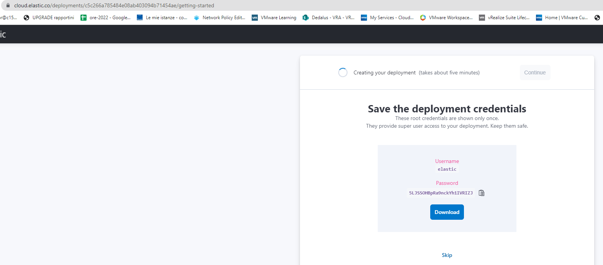

# Monitoring and logging for Kubernetes via Beats -> ElasticSearch, visualization with Kibana

First of all, neither the monitored (test) AKS cluster nor the ElasticCloud (test) instance exist anymore, so I've kept the YAML files nearly unedited.

## Observed cluster's prerequisites

**Metricbeat** relies, to obtain some relevant data, on Kube-State-Metrics, you'll have to deploy it first (on kube-system namespace).

https://artifacthub.io/packages/helm/prometheus-community/kube-state-metrics

## Destination environments

- **Elastic Cloud**: https://cloud.elastic.co





You need to specify only the CloudID and Cloud Auth informations, the Elastic/Kibana target will be automagically resolved

```
    cloud.id: ${ELASTIC_CLOUD_ID}
    cloud.auth: ${ELASTIC_CLOUD_AUTH}

```
```
        - name: ELASTIC_CLOUD_ID
          value: "K8SMonitoring:ZnJhbmNlY2VudHJhbC5henVyZS5lbGFzdGljLWNsb3VkLmNvbTo0NDMkNWRhMmJmMzY3Y2JhNDgwN2E3ZjI4NGI3YTI2ODA4YjYkODg4ZjI3YTQzNjc1NDk1ZTg1YmYxNGIxNTgwYzIwZDg="
        - name: ELASTIC_CLOUD_AUTH
          value: "elastic:J0wA0yLuVs3RJRXix8YifX5X"
```

- **Elastic Cloud on Kubernetes (ECK)**: https://www.elastic.co/guide/en/cloud-on-k8s/current/index.html

You'll need to specify both Elastic and Kibana endpoints (IP and port), as well as their credentials (maybe, by copying the ECK generated secret from the destination cluster)

```
    output.elasticsearch:
      hosts: ['${ELASTICSEARCH_HOST:elasticsearch}:${ELASTICSEARCH_PORT:9200}']
      username: ${ELASTICSEARCH_USERNAME}
      password: ${ELASTICSEARCH_PASSWORD}
      ssl.verification_mode: none

    setup.kibana:
      host: "${KIBANA_HOST}:${KIBANA_PORT}"
      ssl.verification_mode: none
```

```
        env:
        - name: ELASTICSEARCH_HOST
          value: "https://20.74.24.175"
        - name: ELASTICSEARCH_PORT
          value: "9200"
        - name: KIBANA_HOST
          value: "https://20.74.25.186"
        - name: KIBANA_PORT
          value: "5601"
        - name: ELASTICSEARCH_USERNAME
          value: elastic
        - name: ELASTICSEARCH_PASSWORD
          valueFrom:
            secretKeyRef:
              name: monitor-es-elastic-user
              key: elastic
```

## Processors' additional configuration

If you're planning to centralize logging and monitoring for multiple AKS clusters on a single ElasticSearch instance while retaining the ability of filtering "per cluster" incoming data, you should manually instruct Filebeat/Metricbeat to add the needed informations on every flow.

```
    processors:
      - add_cloud_metadata:
      - add_host_metadata:
      - add_fields:
          target: orchestrator.cluster
          fields:
            name: linkerdtest
            url: https://linkerdtest-dns-7975b0cb.hcp.francecentral.azmk8s.io:443
```

## Metricbeat Kubernetes-specific dashboards autodeploy

This additional setting on Metricbeat's config file will automatically load on destination's Kibana some useful dashboards

```
    setup.dashboards.enabled: true
```
